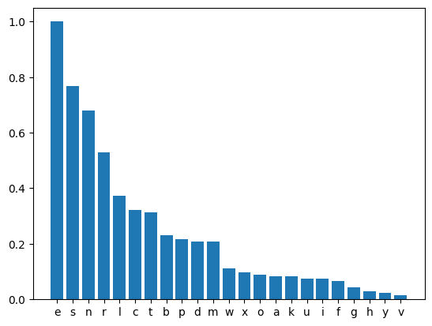
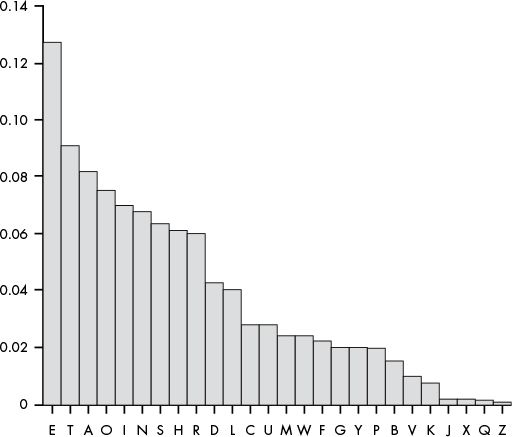

https://www.fbi.gov/news/stories/help-solve-an-open-murder-case-part-2

# Frequencies
## Letter frequency

### Cipher letter frequency  


### English letter frequency  


## Word frequency
Words in cipher and their occurrence
* 'ncbe': 12
* 'n': 21
* 'wld': 6
* 'prse': 5
* 'se': 4
* 'cbe': 3
* 'tfrne': 2
* 'inc': 2
* 'nse': 2
* 'me': 2
* 'r': 2
* 'mkse': 2
* 'mre': 2
  
## English word frequency list
Sorted by most common by length. "a" is actually more common but longer words are more valuable in ciphers, hence the sorting on length
* that
* this
* with
* the
* and
* for
* of
* to
* in
* is
* on
* by
* a

# Guess
We start by adopting the english frequency substitution, and the updating based on some guesses made on word frequencies.  
Current guesses:
## In progress
* se -> 
* ncbe -> time
* prse -> **te
* wld -> and
## Pretty sure
* e -> e
## Maybe


## Updated conversion dict
```python
{
    'e':'e',
    's':'t',
    'n':'i',
    'r':'x',
    'l':'n',
    'c':'x',
    't':'x',
    'b':'x',
    'p':'x',
    'd':'d',
    'm':'x',
    'w':'a',
    'x':'x',
    'o':'x',
    'a':'x',
    'k':'x',
    'u':'x',
    'i':'x',
    'f':'x',
    'g':'x',
    'h':'x',
    'y':'x',
    'v':'x'
}
```
## OG conversion dict
```python
{
    'e': 'e',
    's': 't',
    'n': 'a',
    'r': 'o',
    'l': 'i',
    'c': 'n',
    't': 's',
    'b': 'h',
    'p': 'r',
    'd': 'd',
    'm': 'l',
    'w': 'c',
    'x': 'u',
    'o': 'm',
    'a': 'w',
    'k': 'f',
    'u': 'g',
    'i': 'y',
    'f': 'p',
    'g': 'b',
    'h': 'v',
    'y': 'k',
    'v': 'j'
}
```
## Thoughts

I was sure i would dismiss this as nonsense. However, the letter distribution of the cipher is so similar to the english letter distribution. This should imply that there is some 1:1 relationship between the "cipher alphabet" and the english alphabet. I tried all ceasar substitutions so there is not a simple integer shift. If a specific mapping is used, e.g. {a->r, b->e, c->p, ...} there are 26! possibilities, the same number as Saturns mass in kilograms (:  

Still, the fact that the letter distribution matches the english one should make it possible to narrow the possibilities down. An exact substitution did not print anything useful to my eye though.


